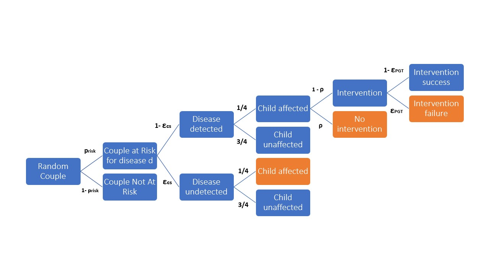

# ECS Cost-effectiveness analyzer
Python library and dashboard to perform deterministic and probabilistic cost effectiveness analysis of
different carrier screening strategies.

## Mathematical Model

Model parameters:

- $p_{carrier}(d)$ carrier rate for disease $d$
- $p_{risk}(d)$ probability for the couple to be at risk for disease $d$
- $\epsilon_{CS}$ false negative rate for carrier screening
- $\rho$ not-intervention probability
- $\epsilon_{PGT}$ intervention failure probability
- $C(d)$ healthcare cost for disease $d$
- $L(d)$ life expectancy change caused by disease $d$
- $\mathcal{D}(\mathcal{S})$ set of diseases screened by strategy $\mathcal{S}$ 
- $C_{CS}(\mathcal{S})$ carrier screening cost for strategy $\mathcal{S}$
- $C_{intervention}$ intervention cost

In case of recessive disease, the probability for a couple to be at risk is:

$$p_{risk}(d) = p_{carrier}(d)^2$$

In case of X-linked disease, the probability for a couple to be at risk is:

$$p_{risk}(d) = p_{carrier}(d)$$

Probability for a child to be affected in case strategy does not screen for disease $d$ is given by Mendelian inheritance rule:

$$p_{affected}(d)=\frac{1}{4} p_{risk}(d)$$

Probability for a child to be affected in case strategy screens for disease $d$:

$$p_{affected}(d)=\frac{1}{4} p_{risk}(d)\left[ \epsilon_{CS} + (1-\epsilon_{CS})\rho + (1-\epsilon_{CS})(1-\rho)\epsilon_{PGT}  \right]$$

Intervention probability in case strategy screens for disease $d$:

$$p_{intervention}(d)=\frac{1}{4} p_{risk}(d) (1-\epsilon_{CS})(1-\rho)$$

The expected total cost for strategy $\mathcal{S}$, screening for disease $\{d_1,...,d_N\}$ is:

$$E[C(\mathcal{S})] = C_{CS}(\mathcal{S}) + \sum_{d\in\mathcal{D}(\mathcal{S})} p_{intervention}(d) C_{intervention} + \sum_{d\in\mathcal{D}(\mathcal{S})} p_{affected}(d) C(d)$$

The expected life years gained (LYG) for strategy $\mathcal{S}$ assuming additive disease effects is:

$$E[LYG(\mathcal{S})] = \sum_{d\in\mathcal{D}(\mathcal{S})} p_{affected}(d) L(d)$$

The Increamental Cost-Effectiveness Ratio (ICER) between strategy $\mathcal{S_1}$ and $\mathcal{S_2}$ is:

$$ICER(\mathcal{S_1};\mathcal{S_2}) = \frac{E \[LYG(\mathcal{S_2})\]-E\[LYG(\mathcal{S_1})\]}{E\[C(\mathcal{S_2})\]-E\[C(\mathcal{S_1})\]}$$

## Use docker to run ECS cost-effectiveness Dashboard locally 

Create docker image:

    docker build -t ecs_dashboard

Run the image as container:

    docker run -p 8080:8053 ecs_dashboard

Visit [0.0.0.0:8080](http://0.0.0.0:8080/) to access dashboard

Custom analysis can be uploaded uploading excel files with custom disease list and custom strategies.
The excel files should be organized as example files in data/ folder.

## Run cost-effectiveness analysis on jupyter notebook

A jupyter notebook to perform deterministic and probabilistic analysis is availalble in 
notebook/cost_effectivness_notebook.ipynb. Make sure that dependencies listed in requirements.txt are satisfied.

## References

IMPLEMENTING PRECONCEPTION EXPANDED CARRIER SCREENING IN A UNIVERSAL HEALTHCARE SYSTEM: A MODEL-BASED COST-EFFECTIVENESS ANALYSIS 

